[Home](./README.md)       
[The Growth Mindset](./README2.md)    
[ Practice in the Terminal](./Terminal.md)   
[Introduction to SQL](./sql.md)    
   [Read:Class 01](./ReadClass01.md)
   # SQL Practice

   - After reading the guidance, completing the exercises and
 completing task list I've got a a solid foundation for understanding SQL queries and learn essential concepts like SELECT statements, filtering data with WHERE, sorting data with ORDER BY, limiting results with LIMIT.
  I've gain the ability to retrieve and manipulate data from relational databases using SQL. 

 - And for the Lessons 13 through 18  I've gain the fundamental aspects of database management such as creating databases and tables, inserting and updating data, enforcing data integrity with constraints, and querying multiple tables using JOINs.
  -----
  ### *The Captured  screen shot of the completed task list.*
  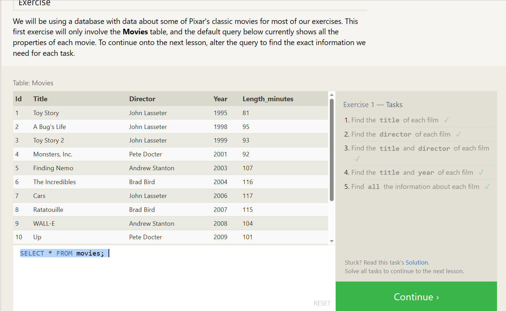
  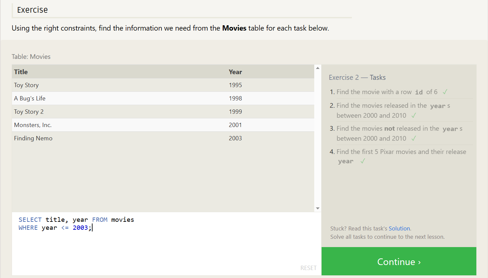
  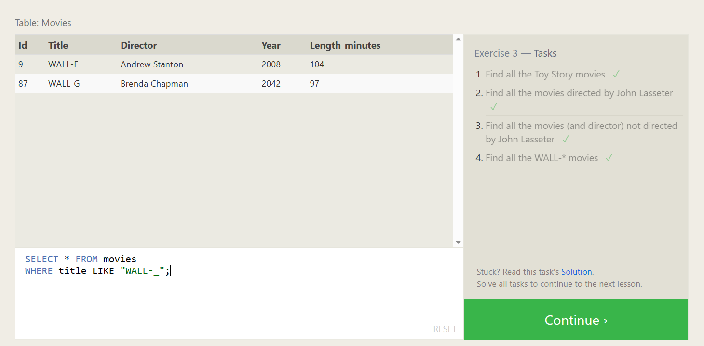
  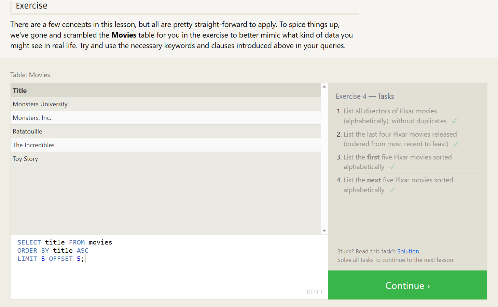
  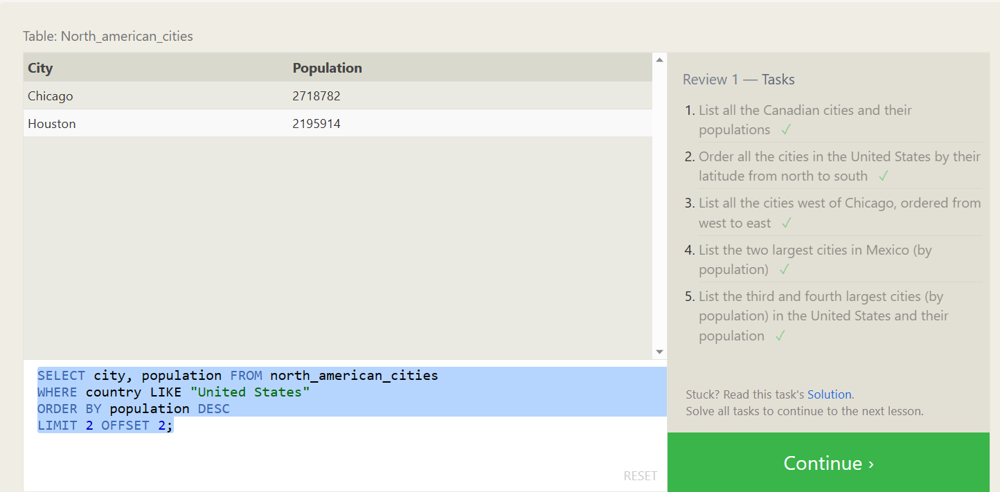
  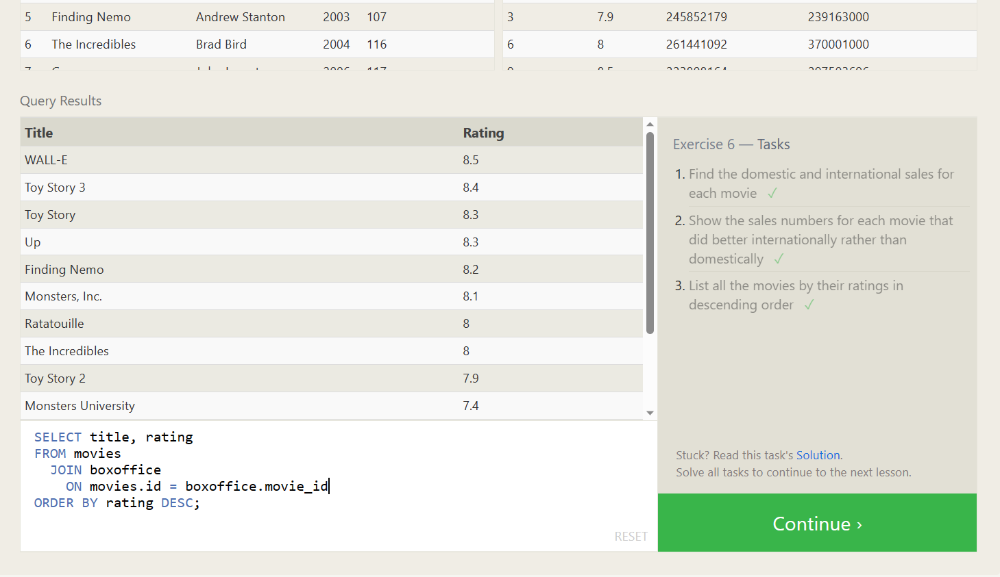
  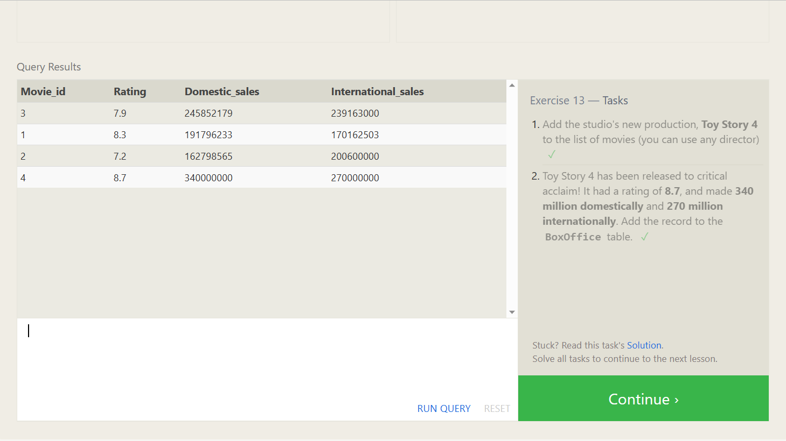
  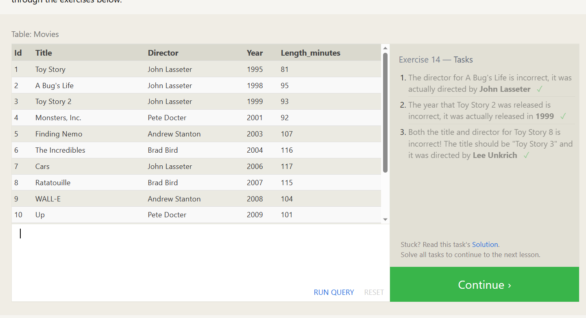
  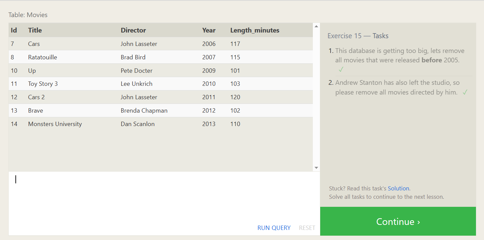
  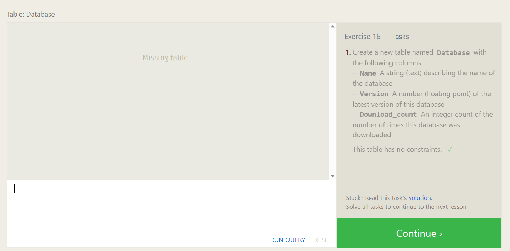
  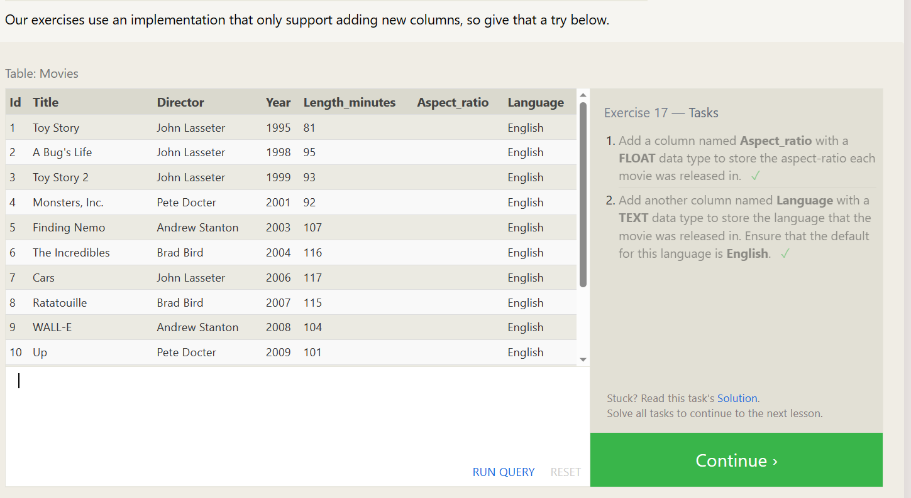
  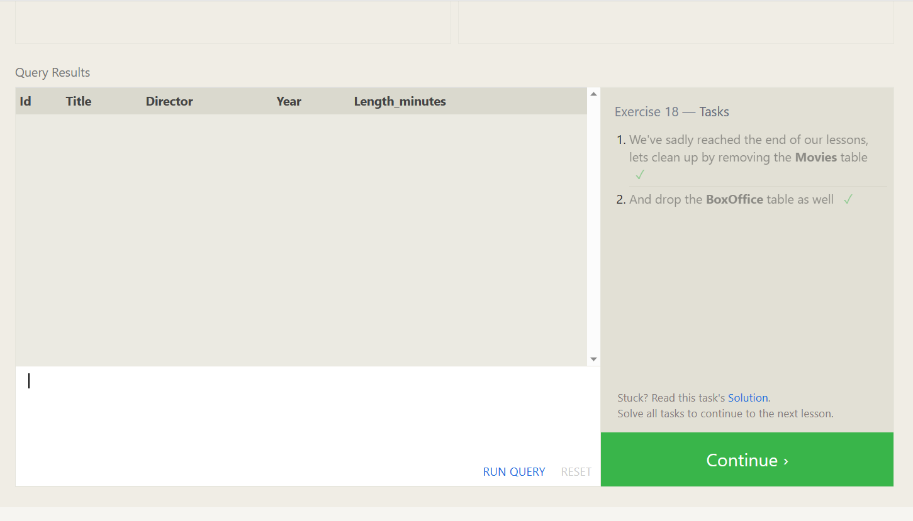
